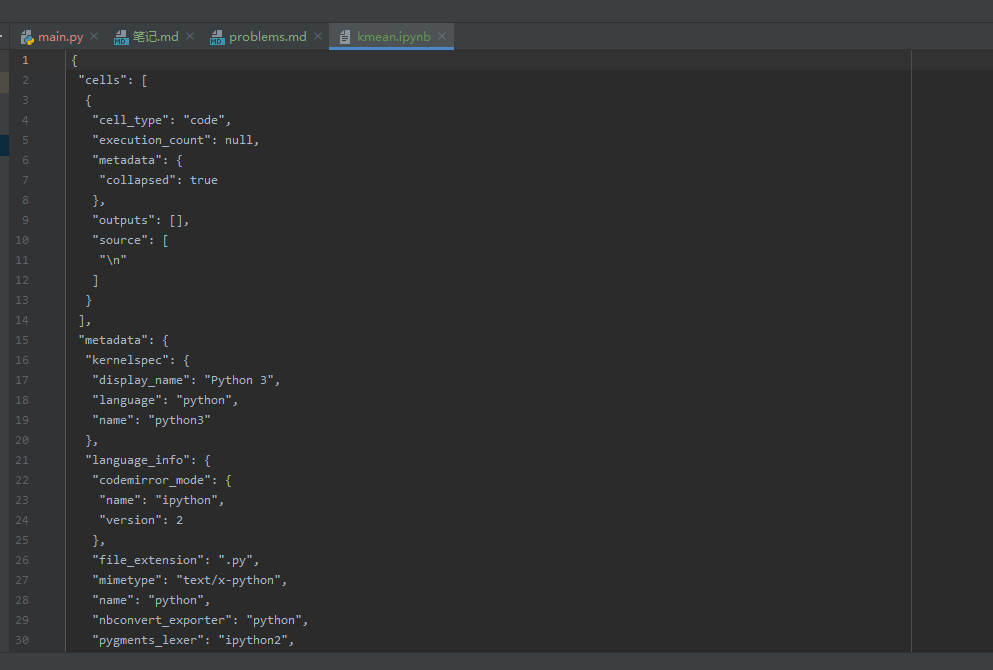
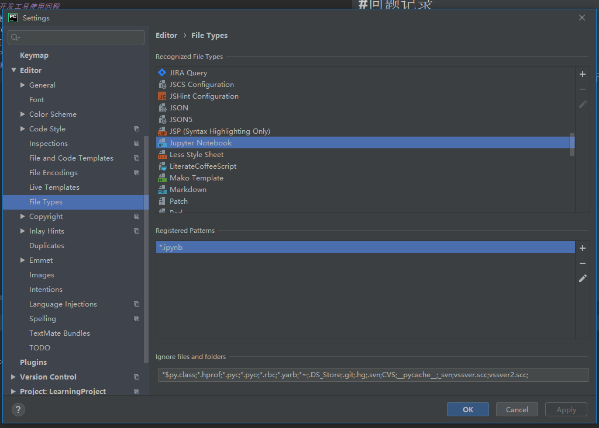
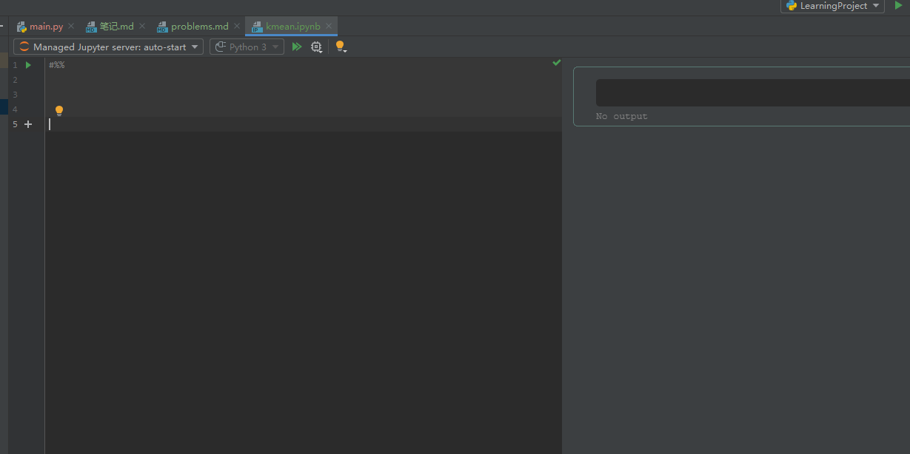

#问题记录
----
##开发工具使用问题
1.使用Pycharm 建立 jupyter notebook 文件，编辑器只显示文件的元信息，不显示 note book 对应的编辑器。
- 问题描述      
 编辑器无法显示工具、编辑器无法识别notebook 文件   ` "cells": [
  {
   "cell_type": "code",
   "execution_count": null,
   "metadata": {
    "collapsed": true
   },
   "outputs": [],
   "source": [
    "\n"
   ]
  }
 ],
 "metadata": {`
   
 - 解决方案  
 
 - 解决后效果   
 
##Python 基础语法问题
##算法问题
